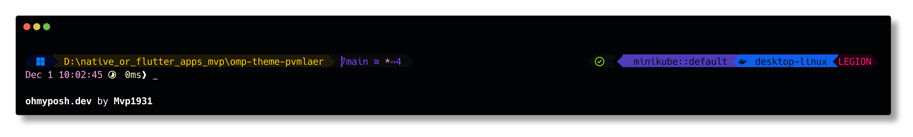

# omp-theme-pvmlaer

## An Oh My Posh prompt theme by Mvp1931.

### Preview



### Installation

1. Download the **zip** from the `< > Code` button above.
2. Unzip the _.zip_ file.
3. Copy the `pvmlaer.omp.json` file in this folder to the oh-my-posh themes folder.
    - On Windows 11/10, this is
    ```cmd
    %LOCALAPPDATA%\Programs\oh-my-posh\themes\
    ```
    - On Linux, this is
    ```bash
    ~/.cache/oh-my-posh/themes/
    ```
4. To enable this theme, use `oh-my-posh init ... /JanDeDobbeleer.omp.json ...` command [as mentioned per shell](https://ohmyposh.dev/docs/installation/prompt) and replace the `jandedobbeleer.omp.json` with `pvmlaer.omp.json` as mentioned in [this page](https://ohmyposh.dev/docs/installation/customize#shell-syntax).
    - On Windows with PowerShell 7+ (also known as _PSCore_ or _pwsh_), this file is in `%ONEDRIVE%\Documents\Powershell\` folder.
    - On Linux,
        - if you are using `bash` this command is used in `~/.bashrc` file.
        - if you are using `fish` this command is used in `~/.config/fish/config.fish` file.
    - For other shells, please refer to [this page](https://ohmyposh.dev/docs/installation/prompt).
5. Restart your terminal to see the effect. Enjoy!

### Customization and Notes

6. Please note that this theme is **not** a part of the [Oh My Posh themes repository](https://github.com/JanDeDobbeleer/oh-my-posh/tree/main/themes).
7. If you want to change the theme, you can do so by editing the `pvmlaer.omp.json` file.
8. Any suggestions or improvements are welcome!
